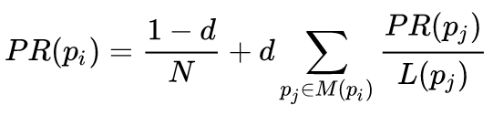

# Link Analysis

## Questions

### ➡️ What are in-links and out-links for a web page?
- **In-links:** links that lead to a web page
- **Out-links:** links in a web page that lead to other pages

### ➡️ How is anchor text used in web search?
Anchor text is the text used in HTML anchor (`a`) tags. It represents how other
pages refer to a certain page, meaning it can potentially be used as a signal but
can also lead to misleading results (Google bombing).

## Exercises

### PageRank ([Source](https://aidanhogan.com/teaching/cc5212-1-2016/exercises/ex-pagerank.pdf))



Page / Iteration|1|2|3
----------------|-|-|-
A|0.250|0.038|0.038
B|0.250|0.462|0.282
C|0.250|0.250|0.430
D|0.250|0.250|0.250

```
It. 2
PR(A) = 0.15 / 4 + 0.85 * 0 = 0.038
PR(B) = 0.15 / 4 + 0.85 * (0.250 / 1 + 0.250 / 1) = 0.462
PR(C) = 0.15 / 4 + 0.85 * (0.250 / 1) = 0.250
PR(D) = 0.15 / 4 + 0.85 * (0.250 / 1) = 0.250

It. 3
PR(A) = 0.15 / 4 + 0.85 * 0 = 0.038
PR(B) = 0.15 / 4 + 0.85 * (0.038 / 1 + 0.250 / 1) = 0.282
PR(C) = 0.15 / 4 + 0.85 * (0.462 / 1) = 0.430
PR(D) = 0.15 / 4 + 0.85 * (0.250 / 1) = 0.250
```


Page / Iteration|1|2|3
----------------|-|-|-
A|0.200|0.030|0.030
B|0.200|0.115|0.043
C|0.200|0.115|0.151
D|0.200|0.285|0.140
E|0.200|0.285|0.249

```
It. 2
PR(A) = 0.15 / 5 + 0.85 * 0 = 0.030
PR(B) = 0.15 / 5 + 0.85 * (0.200 / 2) = 0.115
PR(C) = 0.15 / 5 + 0.85 * (0.200 / 2) = 0.115
PR(D) = 0.15 / 5 + 0.85 * (0.200 / 2 + 0.200 / 1) = 0.285
PR(E) = 0.15 / 5 + 0.85 * (0.200 / 1 + 0.200 / 2) = 0.285

It. 3
PR(A) = 0.15 / 5 + 0.85 * 0 = 0.030
PR(B) = 0.15 / 5 + 0.85 * (0.030 / 2) = 0.043
PR(C) = 0.15 / 5 + 0.85 * (0.285 / 2) = 0.151
PR(D) = 0.15 / 5 + 0.85 * (0.030 / 2 + 0.115 / 1) = 0.140
PR(E) = 0.15 / 5 + 0.85 * (0.285 / 2 + 0.115 / 1) = 0.249
```

### HITS
*Using the same graphs as in the PageRank exercises*

**1.**
```
It. 1
H = (1, 1, 1, 1)
A = (1, 1, 1, 1)

It. 2
H = (1, 1, 1, 1) -> (0.5, 0.5, 0.5, 0.5)
A = (0, 2, 1, 1) -> (0, 0.816, 0.408, 0.408)

It. 3
H = (0.816, 0.408, 0.408, 0.816) -> (0.632, 0.316, 0.316, 0.632)
A = (0, 1, 0.5, 0.5) -> (0, 0.816, 0.408, 0.408)
```

**2.**
```
It. 1
H = (1, 1, 1, 1, 1)
A = (1, 1, 1, 1, 1)

It. 2
H = (2, 1, 1, 2, 0) -> (0.632, 0.316, 0.316, 0.632, 0)
A = (0, 1, 1, 2, 2) -> (0, 0.316, 0.316, 0.632, 0.632)

It. 3
H = (0.949, 0.632, 0.632, 0.949, 0) -> (0.589, 0.392, 0.392, 0.589, 0)
A = (0, 0.632, 0.632, 0.949, 0.949) -> (0, 0.392, 0.392, 0.589, 0.589)
```